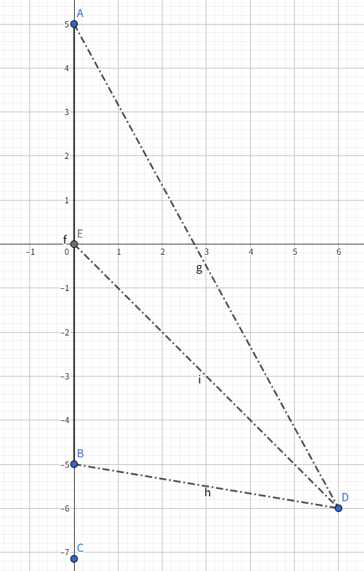

# 静电学

- [静电学](#静电学)
  - [1 电荷与电场](#1-电荷与电场)
    - [1.1 库仑定律](#11-库仑定律)
    - [1.2 电场强度](#12-电场强度)
    - [1.3 叠加原理](#13-叠加原理)
    - [1.4 高斯定理](#14-高斯定理)
    - [1.5 电势能](#15-电势能)
  - 
  - [2 电势](#2-电势)
    - [2.1 环路定理](#21-环路定理)
    - [2.2 电势](#22-电势)
    - [2.3 叠加原理](#23-叠加原理)
    - [2.4 电偶极子](#24-电偶极子)
    - [2.5 拉普拉斯方程和泊松方程](#25-拉普拉斯方程和泊松方程)
  - [3 电场中的导体](#3-电场中的导体)
    - [3.1 静电感应与静电平衡](#31-静电感应与静电平衡)
    - [3.2 电场的唯一性定理与电像法](#32-电场的唯一性定理与电像法)
    - [3.3 电容器](#33-电容器)

## 1 电荷与电场

### 1.1 库仑定律

使用国际单位制[^1]，点电荷之间的相互作用力满足如下的库仑定律

$$
\vec{F} = \frac{1}{4\pi\varepsilon_0} \frac{q_1q_2}{r^2}\hat{r}_{12} \tag{1}
$$

其中 $q_1$ 和 $q_2$ 为两个点电荷的带电量，带电量可以是正的也可以是负的，但是一切物体的带电量一定是 $e = 1.602 \times 10^{-19}C$的整数倍， $r_{12}$ 为 $1$ 指向 $2$ 的位置向量，$\varepsilon_0$ 为物理常数，称为真空介电常数，$\varepsilon_0 \approx 8.85 \times 10^{-12}C^2/(N \cdot m^2)$

**例1.** 在高斯单位制中，长度的基本单位是 $cm$，质量的基本单位是 $g$，时间的基本单位是 $s$，库仑定律写成

$$
\vec{F} = \frac{q_1q_2}{r^2}
$$

此时电量的单位为 $esu$，试给出 $esu$ 和库仑之间的换算关系。

**解：** 在高斯单位制中，力的单位是 $g \cdot cm/s^2$，而在国际单位制中，力的单位是 $kg \cdot m/s^2$，故

$$
\frac{esu^2}{cm^2} = 1 \times 10^{-5} \frac{1}{4\pi\varepsilon_0} \frac{C^2}{m^2}
$$

化简得

$$
1C^2 \approx 9 \times 10^{18} esu^2 \\
1C \approx 3 \times 10^9 esu
$$

故换算关系为 $1C \approx 3 \times 10^9$[^2] $esu$[^3]

### 1.2 电场强度

电荷之间的相互作用是通过场[^4]来传递的，点电荷受力与点电荷带点多少的比值称为电场强度，电场强度是一个矢量，表示为

$$
\vec{E} = \frac{1}{4\pi\varepsilon_0}\frac{q}{r^2}\hat{r}
$$

这样，电场力的大小可以表示为

$$
\vec{F} = q\vec{E} \tag{2}
$$

### 1.3 叠加原理

多个点电荷存在时，某一点的电场强度等于每一个点电荷单独存在时的电场强度的矢量和，对于连续均匀分布的点电荷，则可以化为积分形式。

$$
\vec{E} = \frac{1}{4\pi\varepsilon_0} \iiint \frac{\rho\hat{r}\ dx\ dy\ dz}{r^2}
$$

其中，$\rho$ 表示单位体积所具有的电荷量。

**例2.** 利用叠加原理求一根长度为 $L$，单位长度带电量为 $\lambda$ 的均匀带电线在周围的电场强度分布。

**解：** 首先根据对称性分析，这根电线是向周围辐射对称的，所以我们只需要考虑平面上的例子。

首先，先考虑特殊情况，取一个在这根电线的延长线上的点。我们将这根电线分割为每段长度为 $\Delta l$ 的部分，进行分析可得

$$
\begin{align*}
  E &= k\int^l_0 \frac{\lambda \Delta l}{(y + y_0)^2} \\
    &= k \lambda (\frac{1}{y_0} - \frac{1}{y_0 + l})
\end{align*}
$$

其中 $y_0$ 指的是 $BC$ 之间的距离，$k = \frac{1}{4\pi\varepsilon_0}$。

然后考虑一般情况。对于平面上的一个点，若直接设其坐标为 $(x, y)$，正交分解得

$$
\begin{align*}
E_x = \int \frac{x \lambda \Delta l}{(x^2 + (y + m)^2)^\frac{3}{2}} \\
E_y = \int \frac{y \lambda \Delta l}{(x^2 + (y + m)^2)^\frac{3}{2}}
\end{align*}
$$

过于繁琐。所以我们设这个点与原点连线和坐标轴的夹角为 $\theta$，其 $x$ 坐标为 $x$，则

$$
\begin{align*}
E_x &= k \frac{\lambda \Delta l}{\frac{x^2}{sin^2\theta}}sin\theta = k \frac{\lambda}{x}(cos \theta_1 - cos \theta_2) \\
E_y &= k \frac{\lambda \Delta l}{\frac{x^2}{sin^2\theta}}cos\theta = k \frac{\lambda}{x}(sin \theta_2 - sin \theta_1)
\end{align*}
$$

再次合并即可。当 $l \rightarrow \infin, \theta_2 \rightarrow 0, \theta_1 \rightarrow \pi$ 时，$E_y \rightarrow 0, E_x \rightarrow k \frac{2 \lambda}{x}$

**例3.** 利用叠加原理求均匀带电的半球壳在球心处的电场强度，已知球壳半径为 $R$，单位面积带电量为 $\sigma$。

**例4.** 均匀带电球壳内部的电场强度处处为 $0$，一个带电绝缘圆环，试给出一种电荷分布，使得圆环内部各点的场强也都是 $0$。

### 1.4 高斯定理

定义一个曲面的电通量（即初中电流）

$$
\Phi = \iiint\vec{E}\cdot da
$$

其中 $\Delta a$ 为一个微小的面元。则对于静电场，有如下的高斯定理：任意闭合曲面的总电通量正比于曲面内的总电量

$$
\oiint \vec{E} \cdot da = \frac{1}{\varepsilon_0} \iiint \rho\ dv \tag{3}
$$

利用高斯定理可以轻松求得一些对称性良好的带电物体的电场强度分布，例如

1. 均匀带电的球体，在球内的电场强度 $$E = \frac{\rho r}{3\varepsilon_0}$$ 在球外的电场强度 $$E = \frac{\rho R^3}{3\varepsilon_0r^2}$$
2. 无限大的均匀带电平面，在任意一点的电场强度 $$E = \frac{\sigma}{2\varepsilon_0}$$
3. 无限长的均匀带电的直线，在任意一点的电场强度 $$E = \frac{\lambda}{2\pi r\varepsilon_0}$$

高斯定理还可能写成下面的微分形式

$$
\nabla\cdot E = \frac{\rho}{\varepsilon_0}
$$

其中 $\nabla\cdot$ 表示求散度，$\nabla\cdot E = \frac{\delta E_x}{\delta x} + \frac{\delta E_y}{\delta y} + \frac{\delta E_z}{\delta z}$

**例5.** 两个异种点电荷，连接两个点电荷的一条电场线与两者连线的夹角分别为 $\alpha$ 和 $\beta$，求 $\alpha$ 和 $\beta$ 与电荷带电量 $Q$ 和 $q$ 的关系 $(Q \gt q)$

结论：$Q(1 - cos\alpha) = q (1 - cos\beta)$

**例6.** 半径为 $R$ 的均匀带电圆环，电荷的线密度为 $\lambda$。质量为 $m$ 带电量为 $q$ 的点电荷初始位于圆环中心。紧接着收到在圆环平面内的微小扰动，试证明它将做简谐振动并求出振动的频率

### 1.5 电势能

库仑力是一个保守力，点电荷之间的相互作用力所对应的势能为

$$
W = \frac{1}{4\pi\varepsilon_0} \frac{q_1q_2}{r} \tag{4}
$$

若有多个点电荷组成的系统，则系统的总势能为

$$
W = \Sigma_{i \lt j} \frac{1}{4\pi\varepsilon_0} \frac{q_iq_j}{}
$$

##

## 2 电势

### 2.1 环路定理

### 2.2 电势

### 2.3 叠加原理

### 2.4 电偶极子

### 2.5 拉普拉斯方程和泊松方程

## 3 电场中的导体

### 3.1 静电感应与静电平衡

### 3.2 电场的唯一性定理与电像法

### 3.3 电容器

[^1]: 电磁学中还有另一种非常常见的单位制，称为高斯单位制，其系数往往更为简洁，在对电磁学族规了解之后可以参考相关读物自行选用。

[^2]: 准确值为$2.99792458\times10^9$

[^3]: 需要特别注意，这个转换公式必须谨慎使用，因为公式两边的单位并不具有相同的量纲

[^4]: 场的定义为某种物理量在**空间**中的分布情况
